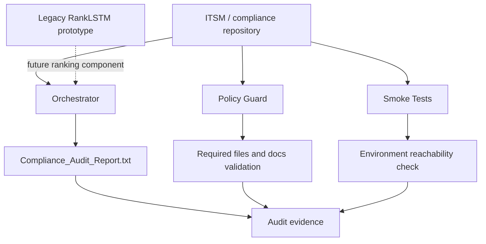

# AI-ITSM Compliance Auto

### Proof-of-concept for ITSM compliance evidence automation

[](https://github.com/JonSil89/AI-ITSM-Compliance-Auto/actions/workflows/compliance-check.yml)
[](https://github.com/JonSil89/AI-ITSM-Compliance-Auto/actions/workflows/policy-guard.yml)

AI-ITSM Compliance Auto is a proof-of-concept for bringing ITSM documentation, compliance evidence and lightweight policy-as-code checks into a CI/CD workflow.

The project demonstrates CI-triggered audit report generation, repository-state validation, smoke testing and a future AI-assisted ranking layer for prioritizing documentation and compliance risks.

This is not a production-ready audit platform.

---

## Project mission

The goal is to show a practical baseline for:

- CI-triggered compliance evidence generation
- lightweight policy-as-code validation
- ITSM documentation control mapping
- smoke testing through environment-specific variables
- audit report generation from repository state
- future AI-assisted documentation risk ranking

The project is intentionally scoped as a portfolio-grade POC. It is designed to be understandable, reviewable and extendable without claiming full enterprise GRC readiness.

---

## Current capabilities

| Capability | Current status | Notes |
| --- | --- | --- |
| Audit report generation | Working POC | `orchestrate.sh` generates `Compliance_Audit_Report.txt` |
| GitHub Actions CI | Working POC | Runs tests and orchestrator |
| Policy Guard | Working POC | Validates required files and documentation baseline |
| Smoke testing | Configurable | Uses `SMOKE_TEST_URL`; skips safely when not configured |
| ISO 27001 mapping | Documentation baseline | See `docs/controls/ISO27001_CONTROL_MAPPING.md` |
| AI ranking component | Legacy / research-inspired | RankLSTM code is included as a prototype component, not the active CI path |
| AWS CodeBuild | Optional example | `buildspec.yml` is a guarded example and does not apply Terraform automatically |

---

## Architecture overview



---

## Quick start

### Requirements

- Git
- Python 3.10+
- Bash or compatible shell

### Clone

```bash
git clone https://github.com/JonSil89/AI-ITSM-Compliance-Auto.git
cd AI-ITSM-Compliance-Auto
```

### Install dependencies

```bash
pip install -r requirements.txt
cp .env.example .env
```

### Run tests

```bash
pytest -q
```

### Run local audit evidence generation

```bash
chmod +x orchestrate.sh
./orchestrate.sh
cat Compliance_Audit_Report.txt
```

---

## Optional smoke test target

Infrastructure smoke testing is environment-specific.

Set `SMOKE_TEST_URL` only when a real test target exists:

```bash
export SMOKE_TEST_URL="https://example.com/health"
pytest tests/smoke/test_infra.py
```

If `SMOKE_TEST_URL` is empty, the smoke test is skipped instead of failing against a placeholder URL.

---

## Repository structure

```text
.github/workflows/
docs/architecture/
docs/controls/
docs/evidence/
docs/policies/
tests/smoke/
RankLSTM_model.py
data_utils.py
main.py
orchestrate.sh
requirements.txt
buildspec.yml
.env.example
```

---

## Legacy RankLSTM component

The RankLSTM files are included as a legacy / research-inspired ranking prototype based on listwise ranking refinement concepts.

They are not required for the current CI audit demo.

Current active validation path:

```text
policy guard -> pytest -> orchestrate.sh -> Compliance_Audit_Report.txt
```

Future direction:

```text
ITSM evidence items -> risk features -> ranking model -> prioritized documentation review queue
```

---

## DevSecOps and policy-as-code model

The project uses GitHub Actions to validate the repository on changes.

Current checks include:

- dependency installation
- pytest execution
- smoke test skip/pass behavior
- orchestrator execution
- required documentation baseline checks
- audit report generation

This demonstrates the workflow pattern rather than a complete enterprise compliance solution.

---

## Non-goals and known constraints

This project is not:

- a production audit system
- a certified ISO 27001 compliance tool
- a full GRC platform
- a production RAG stack
- a production AI agent system
- a complete ITSM integration layer
- a production Terraform deployment model

Known constraints:

- RankLSTM code is legacy/research-style and not part of the active CI path.
- ISO 27001 mapping is a lightweight documentation baseline, not a complete ISMS.
- Smoke testing requires a real environment URL through `SMOKE_TEST_URL`.
- Generated audit evidence is repository-state evidence, not an external compliance certification.

---

## Portfolio framing

> This repository demonstrates a proof-of-concept for ITSM compliance evidence automation: CI-triggered audit report generation, lightweight policy-as-code checks, smoke testing, ISO 27001 control mapping and a future AI-ranking component for documentation risk prioritization.
